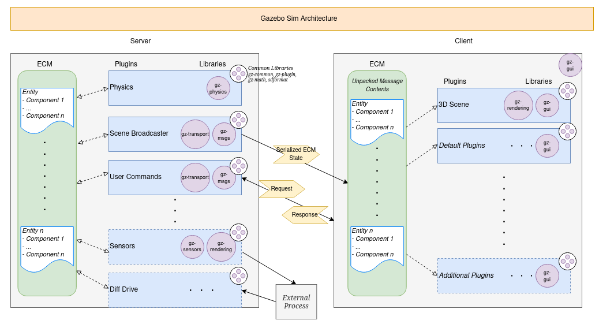

# Gazebo Hints

## Gazebo

<aside>
 Gazebo version 8 (Harmonic) will be used for the entire project

</aside>

- From now we can’t embed the server only and connect a gazebo client on the server. Indeed the server is also rendering the gazebo gui so the container has to be ran in local.

### Leads to implement connection to gazebo server

```docker
FROM ubuntu:22.04

# Mettre à jour les packages et installer les dépendances nécessaires
RUN apt-get update && \
    apt-get install -y \
    software-properties-common \
    lsb-release \
    wget \
    git \
    build-essential \
    ninja-build \
    python3-pip \
    python3-setuptools \
    python3-wheel \
    gnupg \
    lsb-release

RUN wget https://packages.osrfoundation.org/gazebo.gpg -O /usr/share/keyrings/pkgs-osrf-archive-keyring.gpg && \
echo "deb [arch=$(dpkg --print-architecture) signed-by=/usr/share/keyrings/pkgs-osrf-archive-keyring.gpg] http://packages.osrfoundation.org/gazebo/ubuntu-stable $(lsb_release -cs) main" | tee /etc/apt/sources.list.d/gazebo-stable.list > /dev/null && \
apt-get update && \
apt-get install gz-harmonic -y

#Utiliser bash au lieu de sh
RUN rm /bin/sh && ln -s /bin/bash /bin/sh

```



Gazebo Architecture

<aside>
 We can see here that **gazebo** is composed of **client** and **server** module. On some website they use the `gzclient` and `gzserver` commands but there are not compatible with our gazebo version.

</aside>

## Commands

- `gz sim -g` : launch gazebo in gui mode
- `gz sim -s` : launch gazebo in server mode

<aside>
 Be careful if you want to attach px4 to gazebo because gazebo needs resources to render models via environment variable `GAZEBO_RESOURCE_PATH` . The python script bellow allow you to automatically links resources and start gazebo

</aside>

[PX4-gazebo-models/simulation-gazebo at main · PX4/PX4-gazebo-models](https://github.com/PX4/PX4-gazebo-models/blob/main/simulation-gazebo)

## How gazebo works

Gazebo is working a bit like ros2, there some **publisher** and **listeners** that can communicates. It means that multiples gazebo clients can works on the same host. 

- **GZ_DISCOVERY_MULTICAST_IP**
    - *Value allowed*: Any multicast IP address
    - *Description*: Multicast IP address used for communicating all the discovery messages. The default value is 239.255.0.7.
- **GZ_DISCOVERY_SRV_PORT**
    - *Value allowed*: Any non-negative number in range [0-65535]. In practice you should use the range [1024-65535].
    - *Description*: UDP port used for service discovery. The default value is 10318.

<aside>
 Those environment variables are very important, indeed it allows you to set the multicast ip & port which used to discovers new publishers or listeners

</aside>

<aside>
 Once a new publisher is detected it assigns ports and ip to communicates with it

</aside>

**TIPS :** You can use `GZ_VERBOSE=1` to see transport communications, very useful to see what’s happening behind the scene. 

### PX4 Integration

`HEADLESS=1` can be used while launching px4 to not launching gazebo gui. You can connect a client from this.

---

## Remaining problems

- The first problems is the connection to a distant gazebo client (gui) to the docker gazebo server. Because **we can’t know what port to expose** to communicate with the server because gazebo server set ports at **runtime**.
- We recommend  you to use the network feature of docker to test connexion by launching container with argument :  `--net bridge` (bridge as the default network configuration of docker)