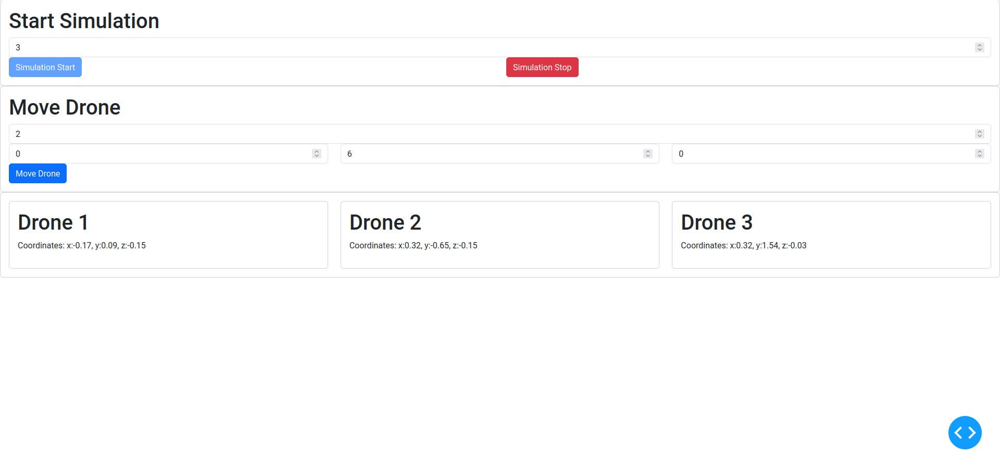

# Src README.md

> 
> 

### Overview

This src/ repository contains :

- back_end
- front_end
- .gitignore
- main.py

This is the source code of a Dash application (Python) which launches a window, in which one can launch different scripts.

### You are a user of the App

When launching the App, you will be showed a window appearing on your screen

The following list is an example of what the app could feature. It is representing features that may not be currently available :

1. Choose the number of drones you want in the field dedicated.
2. Choose the coordinates of the desired spawn point
3. Fill in the table of the coordinate desired for start, intermediate and end point.
4. Click the “spawn” button. A Gazebo window should appear on your screen.
5. Click the “launch” button. The drones displayed in Gazebo should start flying toward the starting point.
6. Click the “move” button. The drones will go to the ending point following the given itinerary.
7. Click the “land” button. The drones will land.
8. Click the “end” button. The Gazebo window will close, killing the simulation.

### You want to modify the code of the App

If you want to add a feature, you need to :

- Add your scripts (Bash, Python…) in the back_end/
- Add buttons or other interactive features on the Dash window in the front_end/

The integration can be done through the [app.py](http://app.py) files in both sub-directories.